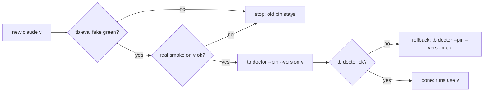

# taskboard

Local Mac task board + agent pipeline daemon. `tbd` = one daemon on 127.0.0.1: reminders, flow tickets, `claude -p` runs with recovery. `tb` = CLI over tbd HTTP. `tb open` = board UI in browser.

## Pin upgrade (new claude version)

Runs use a pinned copy of claude (`~/.taskboard/bin/claude-<v>`), never the self-updating one. New version `<v>` → steps below, in order. Step fails → stop, old pin stays.

1. Fake suite, no usage cost: `bin/tb eval fake` → exit 0.
2. Real smoke on `<v>`, before switch: `CLAUDE_BIN=~/.local/share/claude/versions/<v> node scripts/contain-smoke.js cmds-on edit-on`. Each summary: `escaped_home` empty, `secrets_in_transcript` 0, every `changed` false.
3. Switch: `tb doctor --pin --version <v>`. Copies `~/.local/share/claude/versions/<v>` to `~/.taskboard/bin/claude-<v>`, checks codesign + Team ID, sets `claude_bin`.
4. Check: `tb doctor` → `doctor: ok`.

Rollback: `tb doctor --pin --version <old>` (old copy still in `~/.taskboard/bin/`).

Default pin for new installs: `DEFAULT_PIN` in `lib/util.js` (now 2.1.295).
