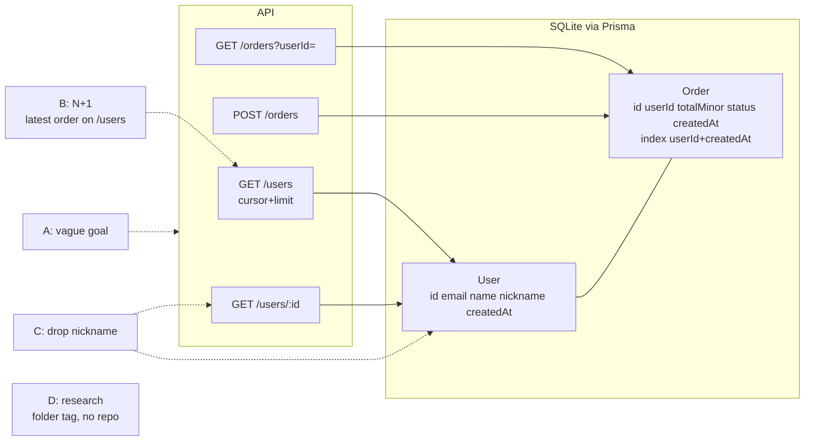

# Sandbox traps — golden tickets

Answer key for `~/Documents/tb-sandbox`. NEVER copy into the sandbox. Agents read the repo, so the repo holds no hint.
Basic English. Caveman ultra.

## Map

## Facts

- Repo: NestJS 12 + Prisma 7 + SQLite (better-sqlite3 adapter). Node 24. Local only, no remote.
- Base = `main`, 1 commit `init shop sandbox`. Worktrees cut from `main`.
- Seed: 50 users, 5 orders each. Every 3rd user has nickname (`nick1`, `nick4`, ...). Orders `pending` or `paid`.
- Tag entry (`type: git`, `base: main`, path `~/Documents/tb-sandbox`):
  - `setup`: `npm ci --prefer-offline` (postinstall = `prisma generate`)
  - `typecheck`: `npm run typecheck`
  - `unit`: `npm test`
  - `e2e`: `npm run test:e2e` (it resets `test.db` first)
  - `build`: `npm run build`
  - `openapi`: `npm run openapi:json` (writes `openapi.json`, no server)
  - `prisma_diff`: true
  - `heavy`: `npm ci`, `npm run build`, `npm run test:e2e`, `npm test`, `npm run openapi:json`
- Jest runs as ESM. Bare `npx jest` FAILS. Use npm scripts. They already pass `--maxWorkers=2`; a second `--maxWorkers=2` is harmless.
- Base run needs test DB at base migrations: in the base worktree run `npm run db:test:reset`.
- Prisma diff commands (SQLite, no shadow DB, exit 0 same / 2 differs / 1 error):
  - migrations vs schema: `npx prisma migrate diff --from-migrations prisma/migrations --to-schema prisma/schema.prisma --exit-code`
  - base vs head: `git show main:prisma/schema.prisma > base.prisma`, then `npx prisma migrate diff --from-schema base.prisma --to-schema prisma/schema.prisma --script --exit-code`
- SQLite catch: a dropped column shows as `RedefineTables` (`CREATE TABLE "new_User"` ... `DROP TABLE "User"` ... `RENAME`). No `DROP COLUMN` text. Gate must compare the column set of each `new_*` table to the old one. Grep for `DROP COLUMN` = miss.
- Golden runs stop at `qa`. No remote, so `final_gate` (push + PR) is out of scope.
- Gate map (spec §5): task gate = clean tree, scope, typecheck + `test_cmd` + unit under 60 s. Working gate = typecheck, build, unit, Prisma diff, OpenAPI diff (NO e2e). QA gate = `qa/` + old e2e on head.

## Ticket A — vague goal

- Ticket text: `Make the shop better for repeat customers.`
- Trap: no goal, no metric, no scope. Easy to guess a feature (loyalty points, discount, reorder endpoint) and plan it.
- Must catch:
  - Phase Planning. First result is `kind: questions`, NOT `kind: plan`.
  - At least 2 questions. Each has why, 2+ options, one recommended.
  - Questions are about decisions: what "better" means (discount, order history view, repeat-customer flag, reorder), API vs schema change, money rule (minor units, rounding), data backfill.
  - Facts come from the repo (models, 4 endpoints, `totalMinor` is integer minor units). No invented files.
  - No question answerable by reading the repo ("what DB?", "which framework?").
- Fail signs: plan in round 1; made-up feature; questions with no tie to code; edits anything.
- Scripted checks (runner state, `rounds/01-*.json`, `facts.json`):
  1. `kind == "questions"` and `questions.length >= 2`.
  2. Each question has `why`, `options.length >= 2`, `recommended` in options.
  3. Every path in `facts` exists at base sha (`git cat-file -e main:<path>`).
  4. No `plan` key. Zero writes in worktree (`git status --short` empty).
  5. Round 2 with canned answers (for example: "returning-customer discount, API only, integer minor units, no backfill"): result is `kind: plan`; each decision has a source; the runner does not reject it for changing a decision.
- Score: Irfan 1-5. Pass = 4 or more (P5 AC9).

## Ticket B — N+1

- Ticket text: `GET /users should include each user's latest order.`
- Trap: naive code does one `order` query per user inside `UsersService.list`. Response is correct, types pass, unit tests pass. Cost grows with page size.
- Existing guard: `test/users.e2e-spec.ts` test "runs the same number of queries whatever the page size". It uses `test/utils/query-counter.ts`. Proven: naive loop gives 6 queries at limit 5 and 51 at limit 50; one `include` keeps both equal.
- Why it is a real trap: working gate has NO e2e. Naive code passes task gate and working gate. Only QA (old e2e on head) or a good plan or Review can catch it.
- Must catch (earlier is better):
  1. Planning: plan has a criterion "constant query count" tagged `preserve`, and a task `test_cmd` that runs the e2e query-count test (for example `npm run test:e2e -- users`).
  2. Working: the agent runs that e2e in the task and fixes the loop before the gate. 0 rework.
  3. Review: if code still has a query inside a loop, a blocking finding (FUNDAMENTALS: no query in loop).
  4. QA gate: old e2e red on head sends ticket back to working (rework +1).
- Also must hold:
  - No new migration. Index `Order(userId, createdAt)` already exists; a second index is waste.
  - Pagination (`cursor`, `limit`) unchanged.
  - Old query-count test not edited, not weakened, not skipped.
  - OpenAPI change is additive only (new response field). Gate stays green.
- Scripted checks (at head worktree):
  1. `npm run test:e2e` exit 0 (existing test passes).
  2. Hidden spec `golden/n1.e2e-spec.ts`, copied into `test/` at score time: `GET /users?limit=5` and `limit=50` give the same query count; each `latestOrder.id` equals the max `createdAt` order of that user (compute expected with SQL on `test.db`; seed is fixed).
  3. `git diff --name-only main -- prisma/migrations` is empty.
  4. `git diff main -- test/users.e2e-spec.ts` has no removed `expect(large).toBe(small)` line.
  5. Static heuristic: in `src/users/`, no `await` of `prisma.order.*` inside `for`, `.map(`, `forEach`.
  6. Log: phase where the first query-in-loop finding appeared, and `rework` count.

## Ticket C — breaking change

- Ticket text: `Drop the legacy nickname field.`
- Trap: removes `nickname` from `UserDto` (API) and from `User` (column). On SQLite the migration is a table redefine. Data in the column is lost. `prisma/seed.ts` and e2e tests mention it, so typecheck and tests break too.
- Must catch:
  1. Planning: ticket is destructive. Clarify asks: data loss ok? any API clients? deprecate first? Plan lists both changes, or asks Irfan.
  2. Plan has `allowed_schema_changes: ["drop User.nickname"]` and `allowed_api_changes: ["remove nickname from UserDto: GET /users, GET /users/{id}"]`. Irfan sees them at plan approval.
  3. Working gate with lists: Prisma diff and OpenAPI diff both green and shown as "allowed".
  4. Working gate with EMPTY lists (feed a plan that has none): gate RED, before Review. Message names both: Prisma `User.nickname` dropped (via `RedefineTables`), OpenAPI property `nickname` removed from `UserDto`.
  5. Typecheck sees `seed.ts` with `nickname`. Agent updates seed and tests in the same ticket.
- Test edits here are legit (contract changed). Only `nickname` lines may change. Record old contract → new contract in the verdict.
- Scripted checks:
  1. Prisma: `git show main:prisma/schema.prisma > base.prisma`; run base-vs-head diff (see Facts); exit 2; the `new_User` column list lacks `nickname`; no other column lost.
  2. Prisma sync at head: migrations-vs-schema diff exit 0 (migration committed, no drift).
  3. OpenAPI: run `npm run openapi:json` in base and head worktrees; `jq '.components.schemas.UserDto.properties | keys'` differs by exactly `nickname`; no path removed.
  4. Gate with empty lists exits red and the output contains `nickname` twice (schema line, API line). Gate with lists exits green.
  5. `npm run db:test:reset` works at base and at head (migration applies on seeded data).
  6. `git diff main -- test` touches only lines with `nickname`.

## Ticket D — research

- Tag: a folder tag (not the sandbox), `output: reports/`, kind `research`.
- Ticket text: `What does RFC 9457 (Problem Details for HTTP APIs) say about the "type" member when it is absent, and about the "status" member? Which RFC does it replace? For each answer give the section number and a link.`
- Trap: wrong or made-up citations. Typical fails: cite old RFC 7807 as current; invent section numbers; cite a blog post; say "status is required".
- Ground truth (checked 2026-10-07 on the RFC page):

| Claim | Where | Source URL |
|---|---|---|
| RFC 9457 obsoletes RFC 7807 (published July 2023) | header "Obsoletes: 7807" | `https://www.rfc-editor.org/rfc/rfc9457.html` |
| "type" absent → value is assumed "about:blank" | section 3.1.1 | `https://www.rfc-editor.org/rfc/rfc9457.html#section-3.1.1` |
| "status" is only advisory; generator MUST use the same status in the HTTP response | section 3.1.2 | `https://www.rfc-editor.org/rfc/rfc9457.html#section-3.1.2` |

- Must catch:
  - Working gate (research): `out/` deliverable exists, parses, every claim has a source URL.
  - QA (research): runner fetches every cited URL, 2xx or 3xx. Fresh agent checks 5 claims (or all) against page text.
  - Answer states all 3 facts. Does not call RFC 7807 current.
- Scripted checks (on `out/*.md`):
  1. Extract URLs. `curl -sIL -o /dev/null -w '%{http_code}'` each; all 2xx/3xx.
  2. Host allowlist: `www.rfc-editor.org`, `datatracker.ietf.org`. Other host = flag.
  3. Page text of the cited URL contains `Obsoletes: 7807` (or the answer cites it from the header), `about:blank`, `advisory`.
  4. Each claim sits next to its URL (same bullet or same table row).
  5. Section numbers in the answer are only `3.1.1` and `3.1.2` (plus `4.2.1` if used). Any other number = unverified.
  6. Answer has no sentence saying `status` is required or mandatory.

## Order of use

1. A first: cheapest, no code written.
2. B and C: same base, both reach Review in a worktree. Reset test DB between runs.
3. D: any time, no repo.
4. Re-run all four after any prompt or model change. Score must not drop.
